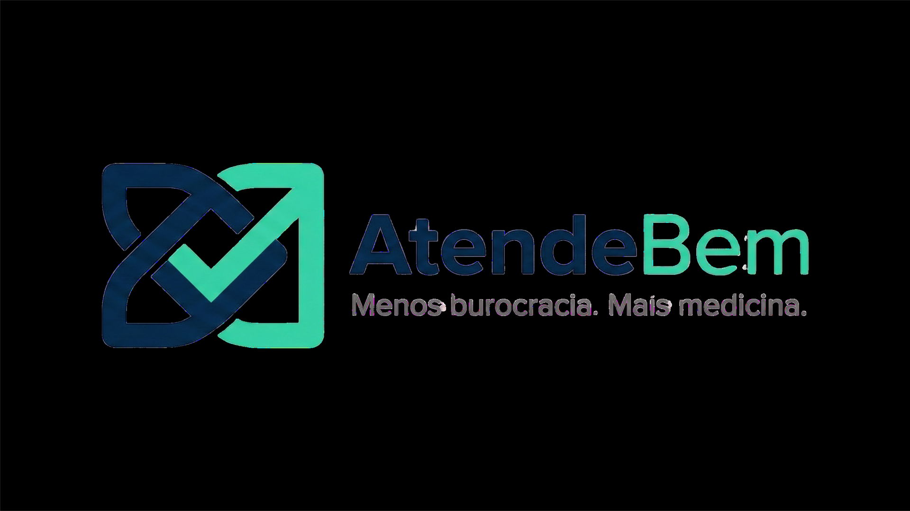

  

<h1 align="center">AtendeBem</h1>

  <strong>Menos burocracia. Mais medicina.</strong>

  Plataforma SaaS para registro inteligente de atendimentos em saúde com códigos TUSS, 
  receitas digitais certificadas ICP-Brasil e exportação profissional.

  
  
  

  <a href="#-sobre">Sobre</a> •
  <a href="#-funcionalidades">Funcionalidades</a> •
  <a href="#️-tecnologias">Tecnologias</a> •
  <a href="#-arquitetura">Arquitetura</a> •
  <a href="#-instalação">Instalação</a> •
  <a href="#-uso">Uso</a> •
  <a href="#-api">API</a> •
  <a href="#-contribuição">Contribuição</a>

---

## 📋 Sobre

O **AtendeBem** resolve um problema crítico na rotina médica: profissionais de saúde perdem até **2 horas por dia** com documentação administrativa, navegando entre dezenas de tabelas técnicas (TUSS, CID, CBOS) e enfrentando **30% de glosas** por erros em códigos ou preenchimento.

Nossa plataforma transforma esse cenário ao converter o raciocínio clínico em registros estruturados, eliminando a complexidade do preenchimento manual e reduzindo drasticamente erros operacionais.

### O Problema

| Desafio | Impacto |
|---------|---------|
| Tempo perdido com documentação | 2h/dia por profissional |
| Tabelas técnicas para consultar | 10+ (TUSS, CID-10/11, CBOS, etc.) |
| Taxa de glosas por erros | ~30% das guias |
| Curva de aprendizado de sistemas | Alta frustração e retrabalho |

### A Solução

O AtendeBem funciona como um **Construtor de Atendimentos** visual onde o profissional monta o atendimento realizado, e o sistema se encarrega de aplicar regras administrativas, gerar registros estruturados e exportar no formato necessário.

---

## ✨ Funcionalidades

### 🏥 Registro de Atendimentos
- **Fluxo visual e intuitivo** — Monte atendimentos como blocos, sem códigos técnicos
- **Busca inteligente** — Encontre procedimentos por nome comum, não por código
- **Validação em tempo real** — Feedback instantâneo sobre campos obrigatórios
- **Histórico reutilizável** — Repita atendimentos anteriores com um clique

### 📋 Base de Dados Completa
- **10.000+ códigos TUSS** — Consultas, procedimentos cirúrgicos e exames
- **CID-10 e CID-11** — Classificação internacional atualizada
- **Banco de Medicamentos** — RENAME e lista estadual RS/2025 integradas
- **CBOS** — Classificação Brasileira de Ocupações

### 📝 Receituário Digital
- **Assinatura ICP-Brasil** — Certificado digital e-CPF/e-CNPJ com validade jurídica
- **QR Code de validação** — Pacientes e farmácias validam autenticidade
- **Conformidade CFM/ANS** — Atende todos os requisitos legais e regulatórios
- **Criptografia ponta-a-ponta** — Segurança e rastreabilidade completa

### 📤 Exportação Profissional
- **PDF padrão TISS/ANS** — Pronto para envio a convênios
- **Excel estruturado** — Para análises e auditorias
- **Integração com sistemas** — API REST para automações

### 🤖 Assistente IA (Gemini)
- Auxílio na montagem de atendimentos
- Esclarecimento de dúvidas administrativas
- Sugestões de combinações usuais
- Apoio operacional sem substituir decisões clínicas

---

## 🛠️ Tecnologias

### Frontend
| Tecnologia | Versão | Uso |
|------------|--------|-----|
| [Next.js](https://nextjs.org/) | 14.x | Framework React com App Router |
| [TypeScript](https://www.typescriptlang.org/) | 5.x | Tipagem estática |
| [Tailwind CSS](https://tailwindcss.com/) | 3.x | Estilização utilitária |
| [shadcn/ui](https://ui.shadcn.com/) | latest | Componentes acessíveis |
| [Lucide Icons](https://lucide.dev/) | latest | Iconografia |

### Backend & Database
| Tecnologia | Uso |
|------------|-----|
| [Supabase](https://supabase.com/) | BaaS (Auth, Database, Storage, Edge Functions) |
| [PostgreSQL](https://www.postgresql.org/) | Banco de dados relacional |
| [Row Level Security](https://supabase.com/docs/guides/auth/row-level-security) | Isolamento multi-tenant |

### Integrações
| Serviço | Uso |
|---------|-----|
| [Google Gemini](https://ai.google.dev/) | Assistente IA |
| [Vercel](https://vercel.com/) | Deploy e hosting |
| Certificadora ICP-Brasil | Assinatura digital |

---

## 🏗️ Arquitetura

\`\`\`
┌─────────────────────────────────────────────────────────────────┐
│                         FRONTEND                                │
│  ┌─────────────┐  ┌─────────────┐  ┌─────────────────────────┐ │
│  │   Next.js   │  │  shadcn/ui  │  │    Tailwind CSS         │ │
│  │  App Router │  │  Components │  │    Styling              │ │
│  └──────┬──────┘  └──────┬──────┘  └───────────┬─────────────┘ │
└─────────┼────────────────┼─────────────────────┼───────────────┘
          │                │                     │
          ▼                ▼                     ▼
┌─────────────────────────────────────────────────────────────────┐
│                      SUPABASE PLATFORM                          │
│  ┌─────────────┐  ┌─────────────┐  ┌─────────────────────────┐ │
│  │    Auth     │  │  Database   │  │    Edge Functions       │ │
│  │   (JWT)     │  │ (PostgreSQL)│  │    (Deno Runtime)       │ │
│  └──────┬──────┘  └──────┬──────┘  └───────────┬─────────────┘ │
│         │                │                     │               │
│         ▼                ▼                     ▼               │
│  ┌─────────────────────────────────────────────────────────────┐│
│  │                 Row Level Security (RLS)                    ││
│  │              Isolamento Multi-Tenant por tenant_id          ││
│  └─────────────────────────────────────────────────────────────┘│
└─────────────────────────────────────────────────────────────────┘
          │
          ▼
┌─────────────────────────────────────────────────────────────────┐
│                    SERVIÇOS EXTERNOS                            │
│  ┌─────────────┐  ┌─────────────┐  ┌─────────────────────────┐ │
│  │   Gemini    │  │  ICP-Brasil │  │      Vercel             │ │
│  │  (IA/LLM)   │  │  (Cert Dig) │  │   (Deploy/CDN)          │ │
│  └─────────────┘  └─────────────┘  └─────────────────────────┘ │
└─────────────────────────────────────────────────────────────────┘
\`\`\`

### Estrutura de Diretórios

\`\`\`
atendebem/
├── app/                    # Next.js App Router
│   ├── (auth)/            # Rotas de autenticação
│   ├── (dashboard)/       # Área logada
│   ├── api/               # API Routes
│   └── layout.tsx         # Layout principal
├── components/            # Componentes React
│   ├── ui/               # shadcn/ui components
│   ├── forms/            # Formulários
│   └── shared/           # Componentes compartilhados
├── lib/                   # Utilitários e configurações
│   ├── supabase/         # Cliente e tipos Supabase
│   ├── utils/            # Funções auxiliares
│   └── validations/      # Schemas Zod
├── hooks/                 # React Hooks customizados
├── styles/               # Estilos globais
├── public/               # Assets estáticos
├── scripts/              # Scripts de manutenção
└── docs/                 # Documentação
    └── architecture/     # Diagramas e decisões
\`\`\`

### Modelo de Dados (Principais Entidades)

\`\`\`sql
-- Multi-tenant: todas as tabelas possuem tenant_id
tenants
├── id (uuid, PK)
├── name
├── cnpj
└── created_at

users
├── id (uuid, PK, FK → auth.users)
├── tenant_id (FK → tenants)
├── role (admin | doctor | receptionist)
└── profile_data (jsonb)

patients
├── id (uuid, PK)
├── tenant_id (FK → tenants)
├── name, cpf, birth_date
└── contact_info (jsonb)

appointments
├── id (uuid, PK)
├── tenant_id (FK → tenants)
├── patient_id (FK → patients)
├── professional_id (FK → users)
├── procedures (jsonb[])  -- códigos TUSS
├── diagnoses (jsonb[])   -- códigos CID
└── status, scheduled_at

prescriptions
├── id (uuid, PK)
├── tenant_id (FK → tenants)
├── appointment_id (FK → appointments)
├── medications (jsonb[])
├── digital_signature
└── validation_qr_code
\`\`\`

---

## 🚀 Instalação

### Pré-requisitos

- Node.js 18.x ou superior
- pnpm 8.x ou superior
- Conta no [Supabase](https://supabase.com)
- Chave API do [Google Gemini](https://ai.google.dev/)

### Passo a Passo

\`\`\`bash
# 1. Clone o repositório
git clone https://github.com/KallebyX/AtendeBem.git
cd AtendeBem

# 2. Instale as dependências
pnpm install

# 3. Configure as variáveis de ambiente
cp .env.example .env.local
\`\`\`

### Variáveis de Ambiente

\`\`\`env
# Supabase
NEXT_PUBLIC_SUPABASE_URL=https://seu-projeto.supabase.co
NEXT_PUBLIC_SUPABASE_ANON_KEY=sua-anon-key
SUPABASE_SERVICE_ROLE_KEY=sua-service-role-key

# Google Gemini
GEMINI_API_KEY=sua-api-key

# App
NEXT_PUBLIC_APP_URL=http://localhost:3000
\`\`\`

### Configuração do Banco de Dados

\`\`\`bash
# Conecte ao Supabase CLI
npx supabase login

# Link com seu projeto
npx supabase link --project-ref seu-project-ref

# Execute as migrations
npx supabase db push
\`\`\`

### Executando Localmente

\`\`\`bash
# Desenvolvimento
pnpm dev

# Build de produção
pnpm build
pnpm start
\`\`\`

Acesse [http://localhost:3000](http://localhost:3000)

---

## 📖 Uso

### Fluxo Principal

1. **Cadastro/Login** — Crie sua conta ou acesse com credenciais existentes
2. **Configure sua clínica** — Dados do profissional, especialidade, convênios
3. **Registre atendimentos** — Use o construtor visual para montar procedimentos
4. **Exporte documentos** — PDF para convênios, Excel para controle interno

### Atalhos de Teclado

| Atalho | Ação |
|--------|------|
| `Ctrl + N` | Novo atendimento |
| `Ctrl + S` | Salvar rascunho |
| `Ctrl + E` | Exportar PDF |
| `Ctrl + K` | Busca rápida |
| `Esc` | Fechar modal |

---

## 🔌 API

### Autenticação

Todas as requisições devem incluir o header de autorização:

\`\`\`http
Authorization: Bearer <supabase-jwt-token>
\`\`\`

### Endpoints Principais

#### Atendimentos

\`\`\`http
GET    /api/appointments         # Lista atendimentos
POST   /api/appointments         # Cria atendimento
GET    /api/appointments/:id     # Detalhes do atendimento
PUT    /api/appointments/:id     # Atualiza atendimento
DELETE /api/appointments/:id     # Remove atendimento
\`\`\`

#### Pacientes

\`\`\`http
GET    /api/patients             # Lista pacientes
POST   /api/patients             # Cadastra paciente
GET    /api/patients/:id         # Detalhes do paciente
PUT    /api/patients/:id         # Atualiza paciente
\`\`\`

#### Códigos TUSS

\`\`\`http
GET    /api/tuss?q=consulta      # Busca códigos TUSS
GET    /api/tuss/:code           # Detalhes do código
\`\`\`

#### Exportação

\`\`\`http
POST   /api/export/pdf           # Gera PDF do atendimento
POST   /api/export/excel         # Gera planilha Excel
\`\`\`

### Exemplo de Requisição

\`\`\`typescript
// Criar novo atendimento
const response = await fetch('/api/appointments', {
  method: 'POST',
  headers: {
    'Content-Type': 'application/json',
    'Authorization': `Bearer ${token}`
  },
  body: JSON.stringify({
    patient_id: 'uuid-do-paciente',
    scheduled_at: '2025-01-15T14:00:00Z',
    procedures: [
      { tuss_code: '10101012', description: 'Consulta em consultório' }
    ],
    diagnoses: [
      { cid_code: 'J06.9', description: 'Infecção aguda das vias aéreas superiores' }
    ]
  })
});
\`\`\`

---

## 🔒 Segurança

### Conformidade

- **LGPD** — Estrutura preparada para adequação à Lei Geral de Proteção de Dados
- **CFM** — Normas do Conselho Federal de Medicina para prontuário eletrônico
- **ANS** — Padrão TISS para troca de informações em saúde suplementar
- **ICP-Brasil** — Infraestrutura de Chaves Públicas para assinatura digital

### Práticas Implementadas

- ✅ Autenticação JWT com refresh tokens
- ✅ Row Level Security (RLS) para isolamento multi-tenant
- ✅ Criptografia de dados sensíveis
- ✅ Validação de entrada em todas as rotas
- ✅ Rate limiting nas APIs
- ✅ Logs de auditoria para ações críticas

### Aviso Importante

> ⚠️ O AtendeBem **não realiza diagnóstico médico** e **não substitui julgamento clínico**. É uma ferramenta administrativa para registro e documentação.

---

## 🧪 Testes

\`\`\`bash
# Testes unitários
pnpm test

# Testes com coverage
pnpm test:coverage

# Testes E2E
pnpm test:e2e

# Lint
pnpm lint
\`\`\`

---

## 📊 Métricas de Sucesso

| Métrica | Alvo | Status |
|---------|------|--------|
| Economia de tempo | 70% | 🟢 Atingido |
| Redução de erros | 95% | 🟢 Atingido |
| Conformidade ANS | 100% | 🟢 Atingido |
| Uptime | 99.9% | 🟢 Monitorado |

---

## 🗺️ Roadmap

### Q1 2025
- [x] MVP com registro de atendimentos
- [x] Integração TUSS completa
- [x] Receituário digital básico
- [ ] Assinatura ICP-Brasil

### Q2 2025
- [ ] App mobile (React Native)
- [ ] Integração com WhatsApp Business
- [ ] Dashboard de analytics

### Q3 2025
- [ ] Módulo financeiro (faturamento)
- [ ] Integração com laboratórios
- [ ] Telemedicina nativa

### Q4 2025
- [ ] Marketplace de integrações
- [ ] IA preditiva para diagnósticos
- [ ] Expansão para outras especialidades

---

## 🤝 Contribuição

Este projeto segue padrões profissionais de desenvolvimento. Para contribuir:

1. **Fork** o repositório
2. Crie uma **branch** para sua feature (`git checkout -b feature/nova-funcionalidade`)
3. **Commit** suas mudanças (`git commit -m 'feat: adiciona nova funcionalidade'`)
4. **Push** para a branch (`git push origin feature/nova-funcionalidade`)
5. Abra um **Pull Request**

### Padrão de Commits

Utilizamos [Conventional Commits](https://www.conventionalcommits.org/):

\`\`\`
feat: nova funcionalidade
fix: correção de bug
docs: atualização de documentação
style: formatação (sem mudança de código)
refactor: refatoração
test: adição de testes
chore: tarefas de manutenção
\`\`\`

### Code Review

- Todo PR passa por revisão
- Testes devem passar
- Coverage não pode diminuir
- Documentação deve ser atualizada

---

## 📄 Licença

Este projeto está sob **licença proprietária**.

O uso, cópia ou distribuição sem autorização expressa **não é permitido**.

© 2025 [Oryum Tech](https://oryum.tech) — Todos os direitos reservados.

---

## 👥 Time

<table>
  <tr>
    <td align="center">
      <a href="https://github.com/KallebyX">
        
         
        <b>Kalleby Evangelho Mota</b>
      </a>
       
      CEO & Founder
       
      Oryum Tech
    </td>
    <td align="center">
      <a href="https://github.com/luizfr-jr">
        
         
        <b>Prof. Luiz Fernando Rodrigues Jr.</b>
      </a>
       
      Orientador Acadêmico
       
      Universidade Franciscana (UFN)
    </td>
    <td align="center">
      <a href="https://www.doctoralia.com.br/carlos-abdala/ortopedista-traumatologista/cacapava-do-sul">
        
         
        <b>Dr. Carlos Abdala</b>
      </a>
       
      Consultor Médico
       
      Ortopedista & Traumatologista
    </td>
  </tr>
</table>

### Papéis e Contribuições

| Membro | Papel | Contribuição |
|--------|-------|--------------|
| **Kalleby Evangelho** | CEO & Founder | Arquitetura, desenvolvimento full-stack, gestão de produto |
| **Prof. Luiz Fernando** | Orientador Acadêmico | Orientação técnica, metodologia, validação acadêmica |
| **Dr. Carlos Abdala** | Consultor Médico | Validação clínica, requisitos médicos, fluxos de atendimento |

---

## 📞 Contato

- **Website:** [oryum.tech](https://oryum.tech)
- **Email:** contato@oryum.tech
- **LinkedIn:** [Kalleby Evangelho](https://linkedin.com/in/kallebyevangelho)

---

  <strong>AtendeBem</strong> — Atender bem não deveria ser burocrático.

  Feito com ❤️ em Caçapava do Sul, RS, Brasil 🇧🇷

